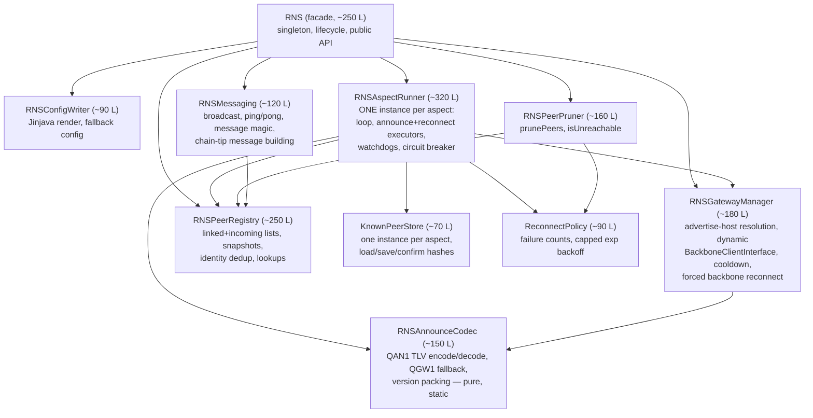

# `RNS.java` — Structural Analysis

**File:** `src/main/java/org/qortal/network/RNS.java`
**Analysed at:** commit `4ec4609a` (branch `HEAD`, detached)
**Scope:** analysis only — no code was changed.

---

## 1. Metrics

| Metric | Value |
|---|---|
| Total lines | 2611 |
| Blank | 168 |
| Comment / javadoc lines | 743 (28%) |
| Effective code lines | ~1700 |
| Lines that are **commented-out code** (contain `(`, `;` or `{`) | ~344 (13% of file) |
| Methods | 68 |
| Lines inside methods | 1741 |
| Fields | 55+ (incl. 4 executors, 2 threads, 8 volatile timers, 6 collections) |
| Inner classes | 3 (`QAnnounceHandler`, `AnnounceInfo`, `SingletonContainer`) + ~100 lines of commented-out `RNSProcessor` |

Longest methods:

| Lines | Method | Line |
|---|---|---|
| 245 | `runBaseLoop` | 567 |
| 155 | `prunePeers` | 2180 |
| 154 | `runDataLoop` | 819 |
| 89 | `shutdown` | 1020 |
| 87 | `maybeAddDynamicGateway` | 1464 |
| 83 | `start` | 396 |
| 77 | `initConfig` | 484 |
| 44 | `maybeAnnounce` | 2336 |
| 43 | constructor | 350 |

`runBaseLoop` alone is nesting depth 7 in places (while → try → if → if → try → lambda → try → for → try).

Context: this is the second-largest class in `org.qortal.network` after `Network.java` (3432) and `NetworkData.java` (2736); `ReticulumPeer.java` is 1633.

---

## 2. Responsibilities currently inside one class

`RNS` is a god class. At least **nine** independent concerns live here, each with its own lifecycle, its own state, and (mostly) no need to know about the others:

| # | Concern | Members involved | Approx. LOC |
|---|---|---|---|
| 1 | **Reticulum config file generation** (Jinjava templating, fallback config, FQDN, gateway server lists) | `initConfig` | ~80 |
| 2 | **Node identity + destination lifecycle** (identity load/create/persist, `baseDestination`, `dataDestination`, proof strategy, callbacks) | `start`, `serverIdentity`, `baseDestination`, `dataDestination` | ~90 |
| 3 | **Announce appData codec** (QAN1 TLV encode/decode, legacy QGW1 fallback, version packing) | `buildAnnounceAppData`, `buildGatewayValue`, `decodeGatewayAppData`, `decodeAnnounceAppData`, `AnnounceInfo`, `parseVersionToLong`, `QAN_*`/`GW_*` constants | ~140 |
| 4 | **Gateway discovery / dynamic interface management** | `maybeAddDynamicGateway`, `isUsableAdvertiseHost`, `getAdvertiseHost`, `getLocalFqdn`, `recentGatewayAttempts`, `maybeForceBackboneReconnect`, `GATEWAY_COOLDOWN` | ~160 |
| 5 | **Peer registry** (two lists × two mirrors, add/remove, identity dedup, snapshot rebuild) | `linkedPeers`, `immutableLinkedPeers`, `incomingPeers`, `immutableIncomingPeers`, `addLinkedPeer`, `removeLinkedPeer`, `addIncomingPeer`, `removeIncomingPeer`, `dedupIncomingPeerByIdentity`, `onIncomingPeerIdentified`, `closeIfActive`, `find*` | ~230 |
| 6 | **Known-peer persistence** (2 files, 4 sets, 4 methods — duplicated per aspect) | `save/loadKnownPeerHashes`, `save/loadKnownDataPeerHashes`, `confirmPeerHash`, `known*`/`loaded*` sets | ~90 |
| 7 | **Reconnect policy / backoff state machine** | `pendingLinkFailureMs`, `pendingDataLinkFailureMs`, `pendingFailureCount`, `recordPendingFailure`, `pendingBackoffMs`, `clearPendingFailure`, reconnect bodies inside both loops | ~180 |
| 8 | **Scheduling engine** (2 polling threads, 4 single-thread executors, 1 worker pool, watchdogs, circuit breaker) | `runBaseLoop`, `runDataLoop`, all `*TaskStartedMs`/`*TaskFuture`/`last*Ms` volatiles, `triggerImmediate*Announce` | ~420 |
| 9 | **Qortal protocol surface** (broadcast, ping/pong, message magic, chain-tip message building, peer misbehaviour) | `broadcast`, `onPingMessage`, `onPeersV2Message`, `buildHeightOrChainTipInfo`, `getMessageMagic`, `peerMisbehaved`, `getAllKnown*Peers`, `getActiveDataPeers` | ~130 |

Concerns 1, 3 and 4 are **pure logic with no dependency on peer state at all** — they are stuck inside a class whose construction spins up an entire Reticulum stack, which makes them effectively untestable today.

---

## 3. The dominant structural problem: BASE/DATA duplication

Almost every piece of state and logic exists **twice**, once per aspect, copy-pasted rather than parameterised:

| BASE | DATA |
|---|---|
| `rnsBaseThread` / `runBaseLoop()` (245 L) | `rnsDataThread` / `runDataLoop()` (154 L) |
| `announceExecutor`, `reconnectExecutor` | `dataAnnounceExecutor`, `dataReconnectExecutor` |
| `lastBaseLoopAnnounceMs`, `lastBaseLoopReconnectMs` | `lastDataLoopAnnounceMs`, `lastDataLoopReconnectMs` |
| `announceTaskStartedMs`, `reconnectTaskStartedMs` | `dataAnnounceTaskStartedMs`, `dataReconnectTaskStartedMs` |
| `announceTaskFuture`, `reconnectTaskFuture` | `dataAnnounceTaskFuture`, `dataReconnectTaskFuture` |
| `knownPeerHashes`, `loadedPeerHashes`, `KNOWN_PEERS_FILE` | `knownDataPeerHashes`, `loadedDataPeerHashes`, `KNOWN_DATA_PEERS_FILE` |
| `pendingLinkFailureMs` | `pendingDataLinkFailureMs` |
| `saveKnownPeerHashes`, `loadKnownPeerHashes` | `saveKnownDataPeerHashes`, `loadKnownDataPeerHashes` |
| `createLinkedPeerFromIdentity` | `createLinkedDataPeerFromIdentity` |
| `baseClientConnected` | `dataClientConnected` |
| `triggerImmediateAnnounce` | `triggerImmediateDataAnnounce` |
| `MIN_DESIRED_CORE_PEERS`, `CORE_ASPECT` | `MIN_DESIRED_DATA_PEERS`, `QDN_ASPECT` |
| `BASE_LOOP_*_INTERVAL_MS` | `DATA_LOOP_*_INTERVAL_MS` |

That is **roughly 600 lines that are one parameterised abstraction away from being ~320**.

Worse, the copies have already **drifted**, which is exactly the failure mode duplication produces:

- `runDataLoop` has **no watchdog**. `runBaseLoop` interrupts a stuck announce/reconnect task after 60 s/45 s and force-reconnects the backbone; `runDataLoop` only checks `dataAnnounceTaskStartedMs == 0L`. If a DATA announce task ever wedges inside `Transport.outbound()`, `dataAnnounceTaskStartedMs` stays non-zero **forever** and DATA announces stop permanently for the process lifetime. Same for DATA reconnect.
- `runDataLoop` has no `consecutiveStuckTasks` participation and no `maybeForceBackboneReconnect()`.
- The BASE reconnect path has the "1 outgoing link per cycle when disconnected" throttle and the precomputed `activeIncomingBaseHashes` O(1) dedup set; the DATA path has neither — it can create N simultaneous outgoing links and never skips peers already ACTIVE as incoming.
- `maybeAnnounce()` (44 L) is two near-identical `if` blocks differing only in the count variable and log prefix.

**This drift is the single strongest argument for the split**: the DATA path is silently missing hard-won robustness fixes that were applied to BASE.

---

## 4. Lombok `@Data` on a stateful singleton

`@Data` on line 113 generates, for all 55+ fields:

- **`toString()`** over every field — including `linkedPeers`, `incomingPeers`, both immutable mirrors, `reticulum`, `serverIdentity`, all executors. Any accidental `log.info("{}", rns)` iterates every peer (each `ReticulumPeer` has its own `@Data`-ish `toString`) while other threads mutate the lists — expensive, and an unsynchronised iteration.
- **`equals()`/`hashCode()`** over every field, on a singleton where identity comparison is the only meaningful semantic. `hashCode()` on a live `ExecutorService`/`Reticulum`/peer-list graph is meaningless and expensive.
- **Public setters for everything**: `setReticulum()`, `setServerIdentity()`, `setBaseDestination()`, `setLinkedPeers()`, `setShuttingDown()`, `setMeshStarted()`… all reachable from any caller. The carefully-guarded invariants in `addLinkedPeer`/`removeLinkedPeer` can be bypassed by a single `setImmutableLinkedPeers(...)`.
- Getters for private internals (`getPendingLinkFailureMs()`, `getKnownPeerHashes()`, …) that were never intended to be API.

The **actual** external surface is small — 16 distinct methods across the whole codebase:

```
getActiveDataPeers(5) markPeerForImmediateRemoval(4) isMeshStarted(4) isShuttingDown(3)
getImmutableLinkedPeers(3) start(2) onPeersV2Message(2) getServerIdentity(2)
triggerImmediateAnnounce shutdown isUnreachable getBaseDestination getAllKnownPeers
dedupIncomingPeerByIdentity confirmPeerHash broadcast
```

So `@Data` is exporting ~100 accessors to serve 16 real call sites. Replacing it with explicit `@Getter` on the handful of fields that need it (or an extracted interface) is a large, near-zero-risk reduction in surface.

---

## 5. Correctness / concurrency observations

These are observations from reading the code; each would need runtime confirmation before being treated as a live defect. Listed roughly by severity.

### 5.1 `shutdown()` uses bitwise `&` instead of `&&` (line 1052)

```java
if (nonNull(pl) & (pl.getStatus() == ACTIVE)) {
```

`&` does not short-circuit, so `pl.getStatus()` is evaluated even when `pl == null` → `NullPointerException` during shutdown as soon as any incoming peer has a null link. The NPE propagates out of `shutdown()`, skipping the linked-peer shutdown, the executor shutdown and `exitHandler()`. `removePeer`/`prunePeers` elsewhere in the same file correctly use `&&`.

### 5.2 Immutable-snapshot rebuild is not atomic on the remove path

`addLinkedPeer` (1907) mutates and rebuilds inside `synchronized (this.linkedPeers)`. `removeLinkedPeer` (1952) and `removeIncomingPeer` (2103) do **not**:

```java
this.linkedPeers.remove(peer);                        // internally synchronized
this.immutableLinkedPeers = List.copyOf(this.linkedPeers);  // separate, unguarded
```

Interleaving: remover reads the backing list → adder (holding the lock) adds a peer and publishes snapshot `{P2}` → remover publishes its stale snapshot `{}`. The new peer is now in `linkedPeers` but **invisible in `immutableLinkedPeers` until the next mutation**. Every consumer (`broadcast`, `runBaseLoop`, `prunePeers`, `getActiveImmutableLinkedPeers`, `findPeerBy*`) reads the snapshot, so the peer is effectively dead while still holding a live link.

### 5.3 Unsynchronised iteration over `Collections.synchronizedList`

`getNonActiveIncomingPeers()` (2163) does `var ips = getIncomingPeers();` — the Lombok getter hands back the **live** synchronized list, not a copy — then for-each over it without holding its monitor. `ConcurrentModificationException` is possible whenever `addIncomingPeer`/`removeIncomingPeer` runs concurrently. `prunePeers()` calls it three times per cycle; `shutdown()` has the same pattern over both raw lists (1050, 1058).

### 5.4 `receivedAnnounce` does network I/O under a lock, on the Transport thread

`QAnnounceHandler.receivedAnnounce` is `@Synchronized` and calls `maybeAddDynamicGateway()`, which constructs a `BackboneClientInterface`, runs `InterfaceUtils.initIFac()` and calls `iface.launch()` — i.e. TCP connect work — while holding the handler lock, on Reticulum's announce-delivery thread. A slow/unreachable announced gateway stalls announce processing. Also note the two handler instances have *separate* Lombok `$lock`s, so the synchronisation does not actually serialise BASE against DATA — it is unclear what it is protecting.

### 5.5 Unbounded maps

- `recentGatewayAttempts` — one entry per `host:port` ever seen, never evicted (cooldown is compared, entries are never removed).
- `pendingLinkFailureMs`, `pendingDataLinkFailureMs`, `pendingFailureCount` — cleared only on `confirmPeerHash` success. A peer that fails forever and never returns keeps its entries forever.

`announcedVersions` is correctly bounded (LRU, 512) — that is the pattern the others should follow.

### 5.6 Constructor swallows failure, leaving a half-built singleton

The constructor catches `IOException` from `new Reticulum(...)`, logs, and continues — leaving `reticulum == null`. `start()` then dereferences `reticulum.getStoragePath()` immediately (line 399) → NPE. Meanwhile `getInstance()` has already published the broken instance, and `isMeshStarted()` stays false forever with no diagnostic beyond the original log line. There is no `reticulumEnabled` setting, so `RNS.getInstance()` from `Controller` (line 995) always triggers this heavy construction.

### 5.7 Semantic naming issues

- `getAllKnownPeers()` / `getAllKnownCorePeers()` / `getAllKnownDataPeers()` return only **currently-active initiator** peers — not "all known", and they omit incoming peers entirely. `Network.getAllKnownPeers()` (Network.java:807) merges this in, so the name mismatch propagates.
- `isUnreachable()` returns boxed `Boolean`; every call site auto-unboxes.
- `maybeRecoverInstance()` is an empty TODO stub, public.

### 5.8 Minor

- `peerMisbehaved` uses `Class.forName("org.qortal.network.ReticulumPeer").isInstance(peer)` with a `ClassNotFoundException` handler, instead of `peer instanceof ReticulumPeer`.
- `QAnnounceHandler` compares aspects with string literals `"qortal.qdn"` / `"qortal.core"` (lines 1629, 1679, 1560) although `CORE_ASPECT`/`QDN_ASPECT` constants exist; and `new String(aspectFilter)` copies a string for no reason.
- Redundant state setting: `createLinkedPeerFromIdentity` calls both `setPeerAspect(BASE)` and `setIsDataPeer(false)`, but `ReticulumPeer.setIsDataPeer` *is* a `setPeerAspect` wrapper. Same in `createLinkedDataPeerFromIdentity` and `getNewPeer`.
- `maybeAnnounce` announces when `count <= MIN_DESIRED`, i.e. it keeps announcing after the target is met.
- Fully-qualified names used inline (`java.util.concurrent.ConcurrentHashMap`, `io.reticulum.interfaces.backbone.BackboneClientInterface`, `java.time.Duration`) even where the import already exists — a symptom of the file having grown past the point where anyone reads the import block.

---

## 6. Performance observations

1. **Two 100 Hz polling threads.** Both loops end with `Thread.sleep(10)` unconditionally. Per iteration each loop builds: a `Stream.concat` of two streams, 2–4 lambda filters, and a `collect(toList())`. That is ~200 peer-list traversals + collector allocations per second at complete idle, in exchange for at most 10 ms of latency improvement over a 100 ms tick. A blocking hand-off (`peer` message availability signalled via a queue/condition) or simply a 50–100 ms sleep would remove nearly all of it.

2. **`getActiveImmutableLinkedPeers()` allocates on every call** (1851): builds a `new ArrayList<>()` **wrapped in `Collections.synchronizedList`** for a value that is immediately returned to a single caller and never shared — pure overhead, and misleading (the wrapper implies thread-safety that the returned snapshot does not need). It is called once per loop iteration in both loops (~200/s), plus 4× per `prunePeers()`, plus in `broadcast`, `maybeAnnounce`, `getActiveDataPeers`, `getAllKnown*Peers`.

3. **`prunePeers()` recomputes the same views repeatedly**: `getActiveImmutableLinkedPeers()` at 2185, 2190, 2324, 2328; `getNonActiveIncomingPeers()` at 2187, 2269, 2326 — each a fresh O(n) traversal + allocation. Line 2185's `initiatorActivePeerList` and 2270's `incomingPeerList` are assigned and never used (dead locals).

4. **INFO-level logging in hot paths.** Per reconnect cycle (every 15 s) the BASE task logs one INFO line per interface, then **two INFO lines per known-peer hash** ("Path to X: hops=…" plus the strategy line). With 50 known peers that is ~100 INFO lines every 15 s = ~24 k lines/hour from one loop. `findPeerByLink`/`findPeerByDestinationHash` log at INFO on every match.

5. **`List.copyOf` on every add/remove** is fine for the current peer counts, but combined with `dedupIncomingPeerByIdentity` (which submits a task per identification) it makes registry mutation O(n) per event.

---

## 7. Dead weight

| Item | Detail |
|---|---|
| Commented-out `RNSProcessor` inner class | lines 1743–1840 (~100 lines) |
| Commented-out `broadcastOurChain`, `buildNewTransactionMessage`, `buildGetUnconfirmedTransactionsMessage` | 996–1018 |
| Commented-out `makePeerAvailable`/`makePeerUnavailable`/`removePeer`/getter blocks | 1891–1902, 1938–1944, 1965–1971, 2110–2116, 2572–2577 |
| Commented-out import lines | ~25 in the header block |
| Unused fields | `MAX_PEERS` (126), `reticulumMaxNetworkThreadPoolSize` (228 — the constructor reads `Settings` directly instead), `PRUNE_INTERVAL` (130, referenced only from commented code), `BROADCAST_INTERVAL` (239, ditto) |
| Unused imports | `SelectionKey`, `AtomicLong`, `Predicate`, `TransactionData`, `BlockData` (each appears only in the import + commented code) |
| Duplicated javadoc | `buildAnnounceAppData` has two stacked javadoc blocks (1191–1210), the first describing the superseded QGW1 format; `dedupIncomingPeerByIdentity` likewise has two (2007–2028), the first attached to the wrong method |
| Dead locals | `initiatorActivePeerList` (2185, 2324), `incomingPeerList = this.incomingPeers` (2270) |

Removing all of this is mechanical and drops the file by roughly **350–400 lines** with zero behavioural change.

---

## 8. Proposed decomposition

The organising idea: **make "aspect" a first-class object instead of a copy-paste axis**, and lift the three stateless concerns (config, codec, gateway) out entirely.



### 8.1 `RNSAnnounceCodec` (highest value, lowest risk)

Pure functions, no state, no Reticulum dependency:
`buildAnnounceAppData(version, gatewayHostOrNull, port)`, `decode(byte[]) → AnnounceInfo`, `parseVersionToLong`, `isUsableAdvertiseHost`. Make `AnnounceInfo` a package-private record/immutable class.

Payoff: the QAN1/QGW1 wire format becomes **unit-testable** for the first time (round-trip, truncation, unknown-TLV skip, legacy fallback, oversized host, port bounds). Today none of that can be tested without constructing `RNS`, which builds a Reticulum stack and 5 thread pools. `RNSNetworkTest.java` exists but cannot reach any of this.

### 8.2 `RNSAspectRunner` (highest structural value)

One class, instantiated twice:

```
new RNSAspectRunner(PeerAspect.BASE, baseDestination, CORE_ASPECT,
                    MIN_DESIRED_CORE_PEERS, knownBaseStore, registry, policy)
new RNSAspectRunner(PeerAspect.DATA, dataDestination, QDN_ASPECT,
                    MIN_DESIRED_DATA_PEERS, knownDataStore, registry, policy)
```

Each instance owns: its thread, its two single-thread executors, its interval/watchdog timers, its known-peer store, its `createLinkedPeerFromIdentity`, its `triggerImmediateAnnounce`. The `activeIncomingHashes` precomputation, the one-link-per-cycle throttle, the watchdog and the circuit breaker are written **once** and therefore apply to both aspects — closing the drift documented in §3. The only genuinely aspect-specific thing left is the `Peer.NETWORK` vs `Peer.NETWORKDATA` message-task selector, which is one constructor parameter.

Estimated reduction: ~600 lines → ~320.

### 8.3 `RNSPeerRegistry`

Owns the four collections and is the *only* place that mutates them. Fixes §5.2 and §5.3 by construction: every mutation takes a single lock and rebuilds the snapshot inside it; every read returns the immutable snapshot (never the live list). `getActivePeers(aspect)` returns a plain `List.copyOf`/`unmodifiableList`, not a pointless `synchronizedList`.

### 8.4 `KnownPeerStore`

One instance per aspect, parameterised by filename and set. Collapses 4 methods + 4 sets + 2 filename constants into one ~70-line class instantiated twice.

### 8.5 `RNSGatewayManager`

`maybeAddDynamicGateway`, `getAdvertiseHost`, `getLocalFqdn`, `recentGatewayAttempts` (with eviction), `maybeForceBackboneReconnect`. Enables the fix for §5.4 — dialling can be moved off the announce thread onto an executor owned by this class without touching the announce path.

### 8.6 `RNSPeerPruner` + `RNSMessaging`

Mechanical lifts. `prunePeers()` in particular is 155 lines of four unrelated passes (initiator prune / non-active incoming / identity dedup / silent-ACTIVE incoming) that become four short private methods.

### 8.7 What `RNS` keeps

Singleton access, `start()`/`shutdown()` orchestration, identity + destination creation, `QAnnounceHandler` registration, and the ~16-method public façade actually used by `Controller`, `Network`, `NetworkData`, `PeersResource`, `ConnectedPeer`, `ArbitraryDataFileManager` and `ReticulumPeer`. Target: **~250 lines**.

---

## 9. Suggested sequencing

Ordered so that each phase is independently shippable and testable, risk increasing down the list.

| Phase | Work | Risk | Δ lines |
|---|---|---|---|
| 0 | Delete commented-out code, unused fields/imports, dead locals, duplicated javadoc | none | −350…−400 |
| 1 | Replace `@Data` with explicit `@Getter`s on the ~8 fields that need them; verify against the 16-call-site list | very low | ~0 (large API-surface reduction) |
| 2 | Fix `&` → `&&` in `shutdown()`; make `getNonActiveIncomingPeers` copy before iterating | very low | ~0 |
| 3 | Extract `RNSAnnounceCodec` (+ unit tests) | very low — pure functions | −140 from `RNS` |
| 4 | Extract `KnownPeerStore`, instantiate ×2 | low | −60 |
| 5 | Extract `RNSGatewayManager` | low | −160 |
| 6 | Extract `RNSPeerRegistry`; make snapshot rebuild atomic on all paths | **medium** — touches every peer mutation | −230 |
| 7 | Extract `RNSPeerPruner`, `RNSMessaging` | low–medium | −280 |
| 8 | Unify `runBaseLoop`/`runDataLoop` into `RNSAspectRunner` | **highest** — but this is where the DATA-path robustness gap gets closed | −280 |
| 9 | Reduce poll frequency / stop allocating in `getActiveImmutableLinkedPeers`; demote hot-path INFO logs to DEBUG | low | small |

Phases 0–5 are ~2/3 of the line reduction at near-zero behavioural risk, and can land before any decision is made about phases 6–8.

---

## 10. Caveats

- The concurrency comments throughout this file (jobsLock contention, `expirePath()` cull cascades, watchdog thread leaks, the ABBA inversion avoided in `closeIfActive`) encode real, painfully-acquired operational knowledge. **Any refactor must carry those comments across verbatim** — several of them are the only record of why an obvious-looking simplification is wrong (e.g. why PENDING links must *not* be torn down, why `removeLinkedPeer` deliberately does not close `peerLink`).
- `RNS` is reachable from `Controller`, `Network`, `NetworkData`, `PeersResource`, `ConnectedPeer`, `ArbitraryDataFileManager` and `ReticulumPeer`. Only 16 methods are used externally, so the façade can stay source-compatible throughout — but `@Data` currently exposes ~100 accessors, so phase 1 should be verified by compilation across the whole tree, not by inspection of `org.qortal.network` alone.
- Items in §5 are read-only findings. Before treating any as a live bug, confirm against logs/runtime — in particular §5.2, whose window is narrow.
- Create a reticulum folder under networking and put all reticulum java files